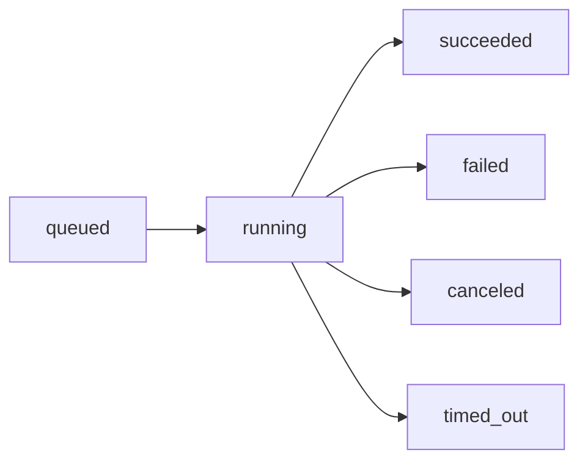

A **Run** represents a single agent execution. You provide instructions and optionally tools, and the agent works to complete the task.

## What is a Run?

When you call `client.run()`, Subconscious creates a Run that:

1. Receives your instructions and tools
2. Processes the request through our inference engine
3. Executes tool calls as needed
4. Returns structured results

## Run Lifecycle

Every Run progresses through a series of states:



| Status      | Description                    |
| ----------- | ------------------------------ |
| `queued`    | Run is waiting to be processed |
| `running`   | Run is actively being executed |
| `succeeded` | Run completed successfully     |
| `failed`    | Run encountered an error       |
| `canceled`  | Run was canceled by the user   |
| `timed_out` | Run exceeded the timeout limit |

## Creating a Run

### Synchronous (Wait for Completion)

The simplest approach—wait for the run to complete:

<CodeGroup>

```python Python
from subconscious import Subconscious

client = Subconscious(api_key="your-api-key")

run = client.run(
    engine="tim-large",
    input={
        "instructions": "Summarize the latest AI news",
        "tools": [{"type": "platform", "id": "web_search"}],
    },
    options={"await_completion": True},
)

print(run.result.answer)
```

```typescript Node.js
import { Subconscious } from "subconscious";

const client = new Subconscious({
  apiKey: process.env.SUBCONSCIOUS_API_KEY!,
});

const run = await client.run({
  engine: "tim-large",
  input: {
    instructions: "Summarize the latest AI news",
    tools: [{ type: "platform", id: "web_search" }],
  },
  options: { awaitCompletion: true },
});

console.log(run.result?.answer);
```

</CodeGroup>

### Asynchronous (Fire and Forget)

Some workloads are better suited for async execution:

- **Long-running tasks** — Many tool calls, large searches, multi-step plans
- **Durability requirements** — You care that they finish, not that you watch every token
- **Fan-out to other systems** — Pipelines, CRMs, warehouses

Start a run without waiting, then check status later:

<CodeGroup>

```python Python
from subconscious import Subconscious

client = Subconscious(api_key="your-api-key")

# Start without waiting
run = client.run(
    engine="tim-large",
    input={"instructions": "Generate a report"},
)

print(f"Run started: {run.run_id}")

# Check status later
status = client.get(run.run_id)
print(status.status)  # 'queued' | 'running' | 'succeeded' | 'failed'
```

```typescript Node.js
import { Subconscious } from "subconscious";

const client = new Subconscious({
  apiKey: process.env.SUBCONSCIOUS_API_KEY!,
});

// Start without waiting
const run = await client.run({
  engine: "tim-large",
  input: { instructions: "Generate a report" },
});

console.log(`Run started: ${run.runId}`);

// Check status later
const status = await client.get(run.runId);
console.log(status.status);
```

</CodeGroup>

### Polling with `client.wait()`

For convenience, use `client.wait()` to automatically poll until the run completes:

<CodeGroup>

```python Python
from subconscious import Subconscious

client = Subconscious(api_key="your-api-key")

# Start a run
run = client.run(
    engine="tim-large",
    input={"instructions": "Generate a detailed report"},
)

# Poll until complete
result = client.wait(
    run.run_id,
    options={
        "interval_ms": 2000,  # Poll every 2 seconds
        "max_attempts": 60,   # Give up after 60 attempts
    },
)

print(result.result.answer)
```

```typescript Node.js
import { Subconscious } from "subconscious";

const client = new Subconscious({
  apiKey: process.env.SUBCONSCIOUS_API_KEY!,
});

// Start a run
const run = await client.run({
  engine: "tim-large",
  input: { instructions: "Generate a detailed report" },
});

// Poll until complete
const result = await client.wait(run.runId, {
  intervalMs: 2000, // Poll every 2 seconds
  maxAttempts: 60, // Give up after 60 attempts
});

console.log(result.result?.answer);
```

</CodeGroup>

### When to Use What

| Pattern                             | Best For                                                                |
| ----------------------------------- | ----------------------------------------------------------------------- |
| **Sync** (`await_completion: true`) | Simple tasks, quick responses                                           |
| **Streaming**                       | Human watching, chat UIs                                                |
| **Async + Polling**                 | Background jobs, dashboards                                             |
| **Async + Webhooks**                | Integrations, pipelines ([see Webhooks](/core-concepts/async-webhooks)) |

## Run Response Structure

When a run completes, you receive a response with these fields:

```typescript
interface RunResponse {
  runId: string;
  status:
    | "queued"
    | "running"
    | "succeeded"
    | "failed"
    | "canceled"
    | "timed_out";
  result?: {
    answer: string;
    reasoning?: Task[];
  };
  usage?: {
    inputTokens: number;
    outputTokens: number;
    durationMs: number;
  };
  error?: {
    code: string;
    message: string;
  };
}
```

### Key Fields

| Field              | Description                                     |
| ------------------ | ----------------------------------------------- |
| `runId`            | Unique identifier for this run                  |
| `status`           | Current state of the run                        |
| `result.answer`    | The agent's final answer                        |
| `result.reasoning` | Step-by-step reasoning process (when available) |
| `usage`            | Token usage and timing information              |
| `error`            | Error details if the run failed                 |

## Canceling a Run

You can cancel a run that's still in progress:

<CodeGroup>

```python Python
from subconscious import Subconscious

client = Subconscious(api_key="your-api-key")

# Cancel a run in progress
client.cancel(run.run_id)
```

```typescript Node.js
import { Subconscious } from "subconscious";

const client = new Subconscious({
  apiKey: process.env.SUBCONSCIOUS_API_KEY!,
});

// Cancel a run in progress
await client.cancel(run.runId);
```

</CodeGroup>

## Related

<CardGroup cols={2}>
  <Card title="Streaming" icon="wave-pulse" href="/core-concepts/streaming">
    Stream responses in real-time
  </Card>
  <Card title="Webhooks" icon="webhook" href="/core-concepts/async-webhooks">
    Get notified when runs complete
  </Card>
  <Card title="Response Handling" icon="code" href="/guides/response-handling">
    Deep dive into parsing run results
  </Card>
  <Card title="Tools" icon="wrench" href="/core-concepts/tools">
    Configure tools for your runs
  </Card>
</CardGroup>
