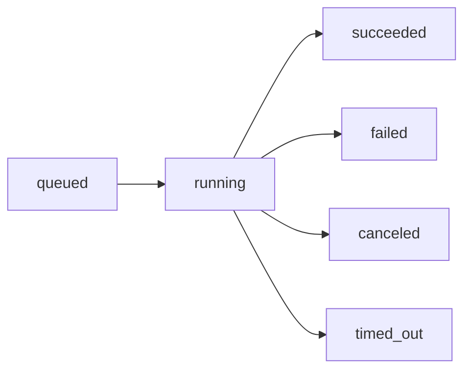

A **Run** represents a single agent execution. You provide instructions and optionally tools, and the agent works to complete the task.

## What is a Run?

When you call `client.run()`, Subconscious creates a Run that:

1. Receives your instructions and tools
2. Processes the request through our inference engine
3. Executes tool calls as needed
4. Returns structured results

## Run Lifecycle

Every Run progresses through a series of states:


```mermaid
graph LR
    A[queued] --> B[running]
    B --> C[succeeded]
    B --> D[failed]
    B --> E[canceled]
    B --> F[timed_out]
```

| Status      | Description                    |
| ----------- | ------------------------------ |
| `queued`    | Run is waiting to be processed |
| `running`   | Run is actively being executed |
| `succeeded` | Run completed successfully     |
| `failed`    | Run encountered an error       |
| `canceled`  | Run was canceled by the user   |
| `timed_out` | Run exceeded the timeout limit |

## Creating a Run

### Synchronous (Wait for Completion)

The simplest approach—wait for the run to complete:

<CodeGroup>

```python Python
from subconscious import Subconscious

client = Subconscious(api_key="your-api-key")

run = client.run(
    engine="tim",
    input={
        "instructions": "Summarize the latest AI news",
        "tools": [{"type": "platform", "id": "web_search"}],
    },
    options={"await_completion": True},
)

print(run.result.answer)
```

```typescript Node.js
import { Subconscious } from "subconscious";

const client = new Subconscious({
  apiKey: process.env.SUBCONSCIOUS_API_KEY!,
});

const run = await client.run({
  engine: "tim",
  input: {
    instructions: "Summarize the latest AI news",
    tools: [{ type: "platform", id: "web_search" }],
  },
  options: { awaitCompletion: true },
});

console.log(run.result?.answer);
```

</CodeGroup>

### Asynchronous (Fire and Forget)

Some workloads are better suited for async execution:

- **Long-running tasks** — Many tool calls, large searches, multi-step plans
- **Durability requirements** — You care that they finish, not that you watch every token
- **Fan-out to other systems** — Pipelines, CRMs, warehouses

Start a run without waiting, then check status later:

<CodeGroup>

```python Python
from subconscious import Subconscious

client = Subconscious(api_key="your-api-key")

# Start without waiting
run = client.run(
    engine="tim",
    input={"instructions": "Generate a report"},
)

print(f"Run started: {run.run_id}")

# Check status later
status = client.get(run.run_id)
print(status.status)  # 'queued' | 'running' | 'succeeded' | 'failed'
```

```typescript Node.js
import { Subconscious } from "subconscious";

const client = new Subconscious({
  apiKey: process.env.SUBCONSCIOUS_API_KEY!,
});

// Start without waiting
const run = await client.run({
  engine: "tim",
  input: { instructions: "Generate a report" },
});

console.log(`Run started: ${run.runId}`);

// Check status later
const status = await client.get(run.runId);
console.log(status.status);
```

</CodeGroup>

### Polling with `client.wait()`

For convenience, use `client.wait()` to automatically poll until the run completes:

<CodeGroup>

```python Python
from subconscious import Subconscious

client = Subconscious(api_key="your-api-key")

# Start a run
run = client.run(
    engine="tim",
    input={"instructions": "Generate a detailed report"},
)

# Poll until complete
result = client.wait(
    run.run_id,
    options={
        "interval_ms": 2000,  # Poll every 2 seconds
        "max_attempts": 60,   # Give up after 60 attempts
    },
)

print(result.result.answer)
```

```typescript Node.js
import { Subconscious } from "subconscious";

const client = new Subconscious({
  apiKey: process.env.SUBCONSCIOUS_API_KEY!,
});

// Start a run
const run = await client.run({
  engine: "tim",
  input: { instructions: "Generate a detailed report" },
});

// Poll until complete
const result = await client.wait(run.runId, {
  intervalMs: 2000, // Poll every 2 seconds
  maxAttempts: 60, // Give up after 60 attempts
});

console.log(result.result?.answer);
```

</CodeGroup>

### When to Use What

| Pattern                             | Best For                                                                |
| ----------------------------------- | ----------------------------------------------------------------------- |
| **Sync** (`await_completion: true`) | Simple tasks, quick responses                                           |
| **Streaming**                       | Human watching, chat UIs                                                |
| **Async + Polling**                 | Background jobs, dashboards                                             |
| **Async + Webhooks**                | Integrations, pipelines ([see Webhooks](/core-concepts/async-webhooks)) |

## Runtime Options

Every `client.run(...)` call accepts an optional `options` block. Some fields are **server-side** (sent to the API and enforced remotely); one field is **client-side only** (used by the SDK to decide whether to poll).

<CodeGroup>

```python Python
run = client.run(
    engine="tim",
    input={
        "instructions": "Research the Q3 earnings call",
        "skills": ["financial-analysis"],
    },
    options={
        "await_completion": True,    # client-side: SDK polls until done
        "timeout": 600,              # server-side: max 10 minutes
        "max_step_tokens": 2000,     # server-side: per-step token cap
        "output": {
            "callback_url": "https://your-server.com/webhooks/runs",
            "response_content": "answer_only",
        },
    },
)
```

```typescript Node.js
const run = await client.run({
  engine: "tim",
  input: {
    instructions: "Research the Q3 earnings call",
    skills: ["financial-analysis"],
  },
  options: {
    awaitCompletion: true,          // client-side: SDK polls until done
    timeout: 600,                   // server-side: max 10 minutes
    maxStepTokens: 2000,            // server-side: per-step token cap
    output: {
      callbackUrl: "https://your-server.com/webhooks/runs",
      responseContent: "answer_only",
    },
  },
});
```

</CodeGroup>

| Field                                 | Where                    | Description                                                                                                  |
| ------------------------------------- | ------------------------ | ------------------------------------------------------------------------------------------------------------ |
| `awaitCompletion` / `await_completion` | **Client-side only**     | When true, the SDK polls `GET /v1/runs/:id` until the run reaches a terminal state. Never sent to the server. |
| `timeout`                             | Server-side              | Maximum run duration in seconds (1–3600). Server cancels the run if exceeded.                                |
| `maxStepTokens` / `max_step_tokens`   | Server-side              | Per-step token ceiling (256–20000). Caps tokens generated in any single reasoning step.                      |
| `output.callbackUrl` / `callback_url`  | Server-side              | Webhook URL the server POSTs to when the run reaches a terminal state.                                       |
| `output.responseContent` / `response_content` | Server-side      | `"full"` (default) returns the complete reasoning tree and answer; `"answer_only"` returns just the answer.  |

<Note>
  `input.skills` is a list of reusable prompt fragments that the server injects into the system prompt for this run. Platform and public skills are global; org-scoped skills require the skill to belong to your organization. Unknown skill names fail the request.
</Note>

## Run Response Structure

When a run completes, you receive a response with these fields:

```typescript
interface RunResponse {
  runId: string;
  status:
    | "queued"
    | "running"
    | "succeeded"
    | "failed"
    | "canceled"
    | "timed_out";
  result?: {
    answer: string;
    reasoning?: ReasoningTask[];
  };
  usage?: {
    inputTokens: number;
    outputTokens: number;
    durationMs?: number;
  };
  error?: {
    code: string;
    message: string;
  };
}

interface ReasoningTask {
  title?: string;
  thought?: string;
  tooluse?: {
    tool_name: string;
    tool_call_id?: string | null;
    parameters: Record<string, unknown>;
    tool_result?: unknown;
  };
  subtasks?: ReasoningTask[];
  conclusion?: string;
}
```

### Key Fields

| Field              | Description                                     |
| ------------------ | ----------------------------------------------- |
| `runId`            | Unique identifier for this run                  |
| `status`           | Current state of the run                        |
| `result.answer`    | The agent's final answer                        |
| `result.reasoning` | Step-by-step reasoning tree (when available)    |
| `usage`            | Token usage and timing information              |
| `error`            | Error details if the run failed                 |

## Multimodal Input

Pass images alongside instructions using the `content` field. Multimodal-capable engines (`tim-claude`, `tim-claude-heavy`) accept `ImageContent` blocks built via the `Image` helper:

<CodeGroup>

```python Python
from subconscious import Subconscious, Image

client = Subconscious()

run = client.run(
    engine="tim-claude",
    input={
        "instructions": "What is in this image?",
        "content": [Image.from_path("shot.png")],
    },
    options={"await_completion": True},
)

print(run.result.answer)
```

```typescript Node.js
import { Subconscious, Image } from "subconscious";

const client = new Subconscious();

const run = await client.run({
  engine: "tim-claude",
  input: {
    instructions: "What is in this image?",
    content: [Image.fromPath("shot.png")],
  },
  options: { awaitCompletion: true },
});

console.log(run.result?.answer);
```

</CodeGroup>

Constructors:

| Constructor                                           | When to use                                            |
| ----------------------------------------------------- | ------------------------------------------------------ |
| `Image.from_path(path)` / `Image.fromPath(path)`      | Read a local file from disk                            |
| `Image.from_bytes(data)` / `Image.fromBytes(buf)`     | Wrap raw bytes you already have in memory              |
| `Image.from_url(url)` / `Image.fromUrl(url)`          | Reference a public URL (server fetches on your behalf) |
| `Image.from_blob_ref(key, mime)` / `fromBlobRef(...)` | Reference an asset already in Subconscious storage     |

Supported MIME types: `image/png`, `image/jpeg`, `image/gif`, `image/webp`. Requests over 5MB raise `RequestTooLargeError` — upload via `/v1/internal/attachments` first and pass `Image.from_blob_ref(...)`.

## Resources

Attach lifecycle-managed services (sandboxes, browsers, memory stores) to your run via `resources`. Each resource initializes before the agent starts, exposes tools during execution, and tears down when the run ends.

<CodeGroup>

```python Python
run = client.run(
    engine="tim",
    input={
        "instructions": "Analyze data.csv and output a chart",
        "resources": ["sandbox"],
    },
    options={"await_completion": True},
)
```

```typescript Node.js
const run = await client.run({
  engine: "tim",
  input: {
    instructions: "Analyze data.csv and output a chart",
    resources: ["sandbox"],
  },
  options: { awaitCompletion: true },
});
```

</CodeGroup>

Currently supported resources: `sandbox` (E2B code execution sandbox).

## Canceling a Run

You can cancel a run that's still in progress:

<CodeGroup>

```python Python
from subconscious import Subconscious

client = Subconscious(api_key="your-api-key")

# Cancel a run in progress
client.cancel(run.run_id)
```

```typescript Node.js
import { Subconscious } from "subconscious";

const client = new Subconscious({
  apiKey: process.env.SUBCONSCIOUS_API_KEY!,
});

// Cancel a run in progress
await client.cancel(run.runId);
```

</CodeGroup>

## Related

<CardGroup cols={2}>
  <Card title="Streaming" icon="wave-pulse" href="/core-concepts/streaming">
    Stream responses in real-time
  </Card>
  <Card title="Webhooks" icon="webhook" href="/core-concepts/async-webhooks">
    Get notified when runs complete
  </Card>
  <Card title="Response Handling" icon="code" href="/guides/response-handling">
    Deep dive into parsing run results
  </Card>
  <Card title="Tools" icon="wrench" href="/core-concepts/tools">
    Configure tools for your runs
  </Card>
</CardGroup>
