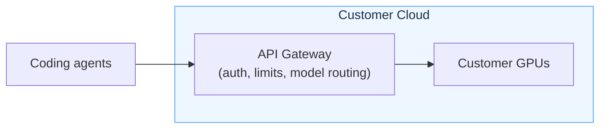

The **API Gateway** is the customer-facing entry point for coding-agent traffic. Coding agents call the API Gateway as their customer-hosted endpoint. The gateway authenticates requests, applies access policy and limits, records usage, and routes the request to a GPU. It runs in the customer-controlled environment and gives administrators a single place to manage access, routing, usage, and day-two operations.

It handles things like:

- End-user API requests from coding agents and SDK clients.
- Load balancing.
- OpenAI- and Anthropic-compatible gateway endpoints.
- Model routing to the Inference Runtime or external model endpoints.
- User and API key management.
- Access controls, limits, and usage tracking.
- Runtime observability, readiness, and operational dashboards.

