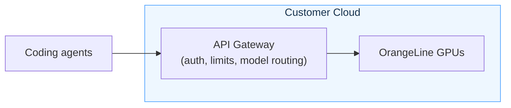

The **API Gateway** is the customer-facing entry point for coding-agent traffic. Coding agents call the API Gateway as their customer-hosted endpoint. The gateway authenticates requests, applies access policy and limits, records usage, and routes the request to OrangeLine. It runs in your AWS, GCP, or Azure account and gives administrators a single place to manage access, routing, usage, context pruning visualization, and day-two operations.

It handles things like:

- End-user API requests from coding agents and SDK clients.
- Load balancing.
- OpenAI- and Anthropic-compatible gateway endpoints.
- Model routing to OrangeLine.
- User and API key management.
- Access controls, limits, and usage tracking.
- Context pruning visualization and intelligence.
- Runtime observability, readiness, and operational dashboards.

```mermaid
flowchart LR
  agents["Coding agents"]

  subgraph customer["Customer Cloud"]
    direction LR
    gateway["API Gateway<br/>(auth, limits, model routing)"]
    orangeline["OrangeLine GPUs"]
    gateway --> orangeline
  end

  agents --> gateway

  style customer fill:#eef7ff,stroke:#4ea3ff,stroke-width:1px,color:#17324d
```
