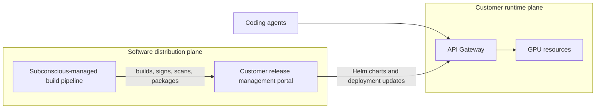

The ORANGE Line has two major components:

- The **customer runtime plane**, deployed in each customer's cloud.
- The **software distribution plane**, where Subconscious manages deployments, releases, and updates.

{/*TODO: Consider upgrading this diagram to a hand-drawn version in Figma for a more approachable look.*/}

## Customer runtime plane

The **customer runtime plane** handles production inference traffic and the runtime administration workflows needed to serve coding agents.

It handles things like:

- End-user API requests from coding agents and SDK clients.
- Load balancing.
- OpenAI- and Anthropic-compatible gateway endpoints.
- Model routing to SGL workers or external model endpoints.
- User and API key management.
- Access controls, limits, and usage tracking.
- Runtime observability, readiness, and operational dashboards.

The runtime plane is built on the [SGL Model Gateway](https://docs.sglang.io/docs/advanced_features/sgl_model_gateway) with lightweight Rust gateway services deployed on Kubernetes. It is the system your engineers use when their coding agents call the customer-hosted endpoint.

## Software distribution plane

The **software distribution plane** is powered by [Distr](https://distr.sh/), a purpose-built software distribution platform for companies shipping software into customer-controlled environments.

It helps deliver:

- Licensed artifacts.
- Deployment instructions.
- Updates and patches.
- Release metadata.
- Vulnerability reports.
- Customer-specific deployment workflows.

For more detail on deployment methods and distribution workflows, see [Methods](/on-prem/deployments/methods) and [Distribution platform](/on-prem/deployments/distribution-platform).

