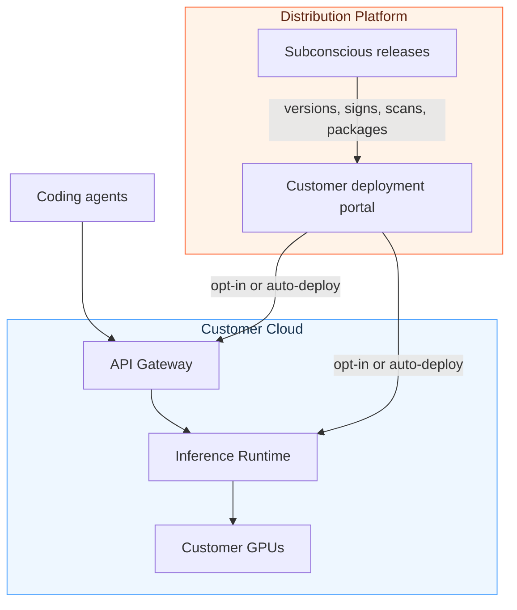

The Subconscious Inference System consists of three core components:

- The **API Gateway**, which handles agent traffic, authentication, routing, API keys, and usage controls.
- The **Inference Runtime**, which drives Subconscious's agent-native, compute-efficiency advantages.
- The **Distribution Platform**, which manages software delivery, versioning, updates, and assisted self-managed deployment.

{/*TODO: Consider upgrading this diagram to a hand-drawn version in Figma for a more approachable look.*/}

## API Gateway

The **API Gateway** is the customer-facing entry point for coding-agent traffic. It runs in the customer-controlled environment and it handles things like:

- End-user API requests from coding agents and SDK clients.
- Load balancing.
- OpenAI- and Anthropic-compatible gateway endpoints.
- Model routing to the Inference Runtime or external model endpoints.
- User and API key management.
- Access controls, limits, and usage tracking.
- Runtime observability, readiness, and operational dashboards.

See [API Gateway](/on-prem/api-gateway/overview).

## Inference Runtime

The **Inference Runtime** is the GPU-backed execution layer that gives the Subconscious Inference System its efficiency advantage. It runs on customer-provided GPUs and is tuned for coding-agent workloads.

It handles things like:

- Model execution on customer GPU resources.
- Cache behavior for agent workloads.
- Batching and scheduling.
- GPU utilization improvements.
- Serving more coding-agent workload per GPU.

See [Inference Runtime](/on-prem/inference-runtime/overview).

## Distribution Platform

The **Distribution Platform** is powered by [Distr](https://distr.sh/), a purpose-built software distribution platform for companies shipping software into customer-controlled environments.

It helps deliver:

- Licensed artifacts.
- Deployment instructions.
- Updates and patches.
- Release metadata.
- Vulnerability reports.
- Customer-specific deployment workflows.

See [Distribution Platform](/on-prem/distribution-platform/overview).

