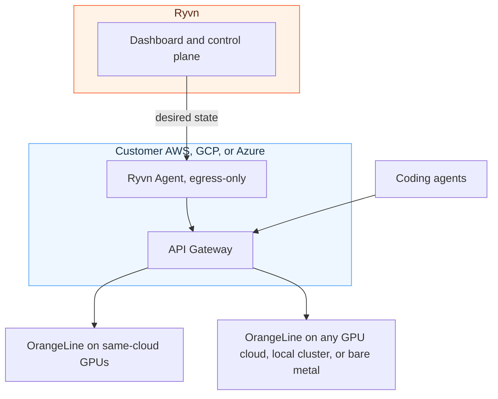

The Subconscious Inference System has three pieces:

- The **API Gateway**, which handles agent traffic, authentication, routing, API keys, usage, and context pruning visualization and intelligence.
- **OrangeLine**, the GPU inference runtime that runs TIMRUN.
- **Ryvn**, the deployment platform that installs and updates the gateway in your AWS, GCP, or Azure account.

See [Methods](/on-prem/deployments/methods) for the two ways to run it: the full inference system, or OrangeLine only.

```mermaid
flowchart TD
  codingAgents["Coding agents"]

  subgraph ryvn["Ryvn"]
    hub["Dashboard and control plane"]
  end

  subgraph customerCloud["Customer AWS, GCP, or Azure"]
    agent["Ryvn Agent, egress-only"]
    gateway["API Gateway"]
    agent --> gateway
  end

  orangelineSame["OrangeLine on same-cloud GPUs"]
  orangelineOther["OrangeLine on any GPU cloud, local cluster, or bare metal"]

  hub -->|"desired state"| agent
  codingAgents --> gateway
  gateway --> orangelineSame
  gateway --> orangelineOther

  style ryvn fill:#fff3e8,stroke:#ff5c28,stroke-width:1px,color:#5f2411
  style customerCloud fill:#eef7ff,stroke:#4ea3ff,stroke-width:1px,color:#17324d
```

## Full inference system

Ryvn deploys the API Gateway into your AWS, GCP, or Azure account. OrangeLine runs on GPUs anywhere you can run a Docker container, including the same cloud, a NeoCloud, an inference platform, your own local cluster, or bare metal. Those workers attach to the gateway as model routes. GPUs do not have to be in the same hyperscaler as the gateway.

This is the path that includes gateway features such as API keys, routing, usage, and **context pruning visualization and intelligence**.

## OrangeLine only

For trials, or if you already have a gateway, we issue registry credentials for the OrangeLine image. You run that container on any GPU host. There is no Ryvn install and no Subconscious API Gateway. OrangeLine still serves models. You will not get context pruning visualization and intelligence without our gateway.

## API Gateway

The **API Gateway** is the customer-facing entry point for coding-agent traffic. It runs in your AWS, GCP, or Azure account and handles:

- End-user API requests from coding agents and SDK clients.
- Load balancing.
- OpenAI- and Anthropic-compatible endpoints.
- Model routing to OrangeLine.
- User and API key management.
- Access controls, limits, and usage tracking.
- Context pruning visualization and intelligence.
- Operational dashboards.

See [API Gateway](/on-prem/api-gateway/overview).

## OrangeLine

**OrangeLine** is the GPU inference runtime. It runs TIMRUN on GPUs you provide and is tuned for coding-agent workloads: model execution, cache behavior, batching, and GPU utilization.

It is a Docker container. Run it anywhere you can pull and run a GPU image. Examples include AWS, GCP, Azure, Nebius, Lambda, CoreWeave, Together AI, Baseten, Modal, other NeoClouds, your own local cluster, and bare metal. If you have GPUs we have not named, we can work with that.

See [OrangeLine](/on-prem/inference-runtime/overview).

## Ryvn

**Ryvn** is the deployment platform for the full inference system. It provisions or connects the gateway environment in your AWS, GCP, or Azure account, deploys the gateway as an installation, and keeps it updated. A [Ryvn Agent](https://ryvn.ai/docs/guides/ryvn-agent) in that cluster pulls desired state over outbound HTTPS. Subconscious does not need inbound access to your VPC.

Ryvn is not required on every GPU host. An OrangeLine worker on a NeoCloud, local cluster, or other provider is a worker the gateway calls, not a second Ryvn environment.

See [Ryvn](/on-prem/ryvn/overview) and [How Ryvn works](https://ryvn.ai/docs/how-ryvn-works).
